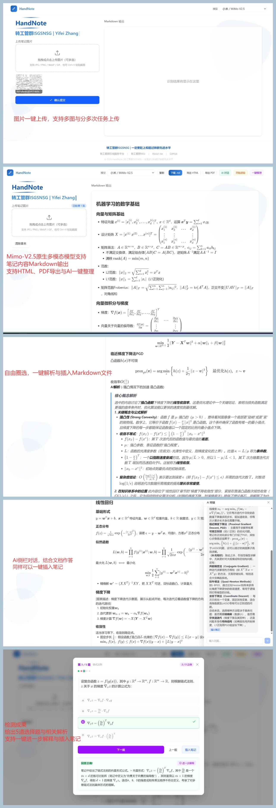

# HandNote

手写笔记照片 → 格式化 Markdown 文档，支持 AI 解析、知识扩展、智能测验和多轮对话

---

HandNote 是一个基于多模态模型的笔记转换工具。上传手写笔记照片，即可获得结构清晰的 Markdown 文档，并提供一些 AI 辅助学习功能。



## 功能特性

### 核心功能

- **手写识别** — 上传手写笔记照片（支持多张），AI 自动识别并转换为 Markdown
- **公式渲染** — 数学公式使用 LaTeX 语法，通过 KaTeX 实时渲染
- **一键整理** — AI 自动重组笔记结构，优化排版和层次

### AI 学习辅助

- **圈选解析** — 选中任意文字，一键获取 AI 深度解析
- **知识扩展** — 点击笔记中的知识点标记，获取详细解释和示例
- **智能测验** — 基于笔记内容自动生成 5 道选择题，检验学习效果
- **AI 对话** — 针对笔记内容进行多轮问答，支持公式推导

### 导出与笔记管理

- **多种导出** — 支持复制 Markdown、下载 .md 文件、导出 HTML、导出 PDF
- **一键插入** — AI 解析、对话、测验结果均可一键插入笔记
- **知识点标记** — 手动为重要内容添加扩展标记，方便后续复习

## 技术栈

| 类别 | 技术 |
|------|------|
| 框架 | Next.js 16 (App Router) + React 19 + TypeScript |
| 样式 | Tailwind CSS v4 |
| AI | OpenAI 兼容 API（MiMo-V2.5 多模态 / DeepSeek 文本） |
| Markdown | react-markdown + remark-gfm + remark-math + rehype-katex + rehype-highlight |
| 公式 | KaTeX |

## 快速开始

### 环境要求

- Node.js >= 18
- npm / pnpm / yarn

### 安装

```bash
git clone https://github.com/your-username/handnote.git
cd handnote
npm install
```

### 配置环境变量

```bash
cp .env.example .env.local
```

编辑 `.env.local`，填入你的 API Key：

```env
# 小米 MiMo 多模态模型
MIMO_API_KEY=your_mimo_api_key_here

# DeepSeek 模型（用于文本推理，可选）
DEEPSEEK_API_KEY=your_deepseek_api_key_here

# 访问口令（用于登录页面验证）
PASSPHRASE=your_passphrase_here
```

**获取 API Key：**

| 模型 | 提供商 | 获取地址 |
|------|--------|---------|
| MiMo-V2.5 | 小米 | [api.xiaomimimo.com](https://api.xiaomimimo.com) |
| DeepSeek | DeepSeek | [platform.deepseek.com](https://platform.deepseek.com) |

> MiMo-V2.5 是必需的，因为它支持图片理解（多模态）。DeepSeek 仅用于文本推理场景，可不配置。

### 启动开发服务器

```bash
npm run dev
```

访问 [http://localhost:3000](http://localhost:3000)，输入 `PASSPHRASE` 口令即可使用。

### 生产构建

```bash
npm run build
npm run start
```

## 使用指南

### 1. 上传笔记

- 支持拖拽上传、点击选择、Ctrl+V 粘贴
- 支持 JPG / PNG / WebP / GIF / BMP 格式，单张最大 10MB
- 可同时上传多张图片，内容自动拼接

### 2. AI 识别

上传图片后点击"确认提交"，AI 会自动将手写内容转换为 Markdown。识别结果在右侧面板实时渲染，包含：

- 标题层级（H1-H3）
- 数学公式（行内 `$...$` 和独立 `$$...$$`）
- 表格、列表、代码块
- 知识点扩展标记（蓝色胶囊按钮）

### 3. 圈选解析

在右侧渲染结果中选中任意文字，会弹出浮动工具栏：

- **AI 解析** — 获取选中内容的深度解释
- **添加标记** — 为选中内容添加知识点扩展标记

> 请在第一次 AI 解析完成后再发起第二次。

### 4. 知识扩展

点击笔记中的蓝色胶囊按钮（如 `Softmax`、`梯度下降`），AI 会给出：

- 直觉解释
- 形式化定义
- 简单示例
- 公式中每个符号的含义

### 5. 智能测验

点击顶部"测验"按钮，基于当前笔记生成 5 道选择题：

- 2 道基础 + 2 道中等 + 1 道困难
- 支持提交答案、放弃查看、跳转题目
- 答错可获取"进一步解释"
- 完成后显示正确率

### 6. AI 对话

点击顶部"AI 对话"按钮，打开侧边栏对话面板：

- 基于笔记内容回答问题
- 支持公式推导和逐步解释
- 超出笔记范围的内容会标注"（补充知识）"
- 对话记录可一键插入笔记

### 7. 导出

- **复制** — 将 Markdown 复制到剪贴板
- **下载 .md** — 下载 Markdown 文件
- **导出 HTML** — 生成带样式的独立 HTML 文件（含 KaTeX 渲染）
- **导出 PDF** — 打开打印对话框，可保存为 PDF

## 模型配置

项目使用 OpenAI 兼容 API，支持接入任何兼容的模型。模型配置在 `src/lib/models.ts` 中：

```typescript
const MODELS = [
  {
    id: "mimo",
    name: "MiMo-V2.5",
    provider: "小米",
    baseURL: "https://api.xiaomimimo.com/v1",
    model: "mimo-v2.5",
    envKey: "MIMO_API_KEY",
    supportsVision: true,
  },
  {
    id: "deepseek",
    name: "DeepSeek",
    provider: "DeepSeek",
    baseURL: "https://api.deepseek.com",
    model: "deepseek-chat",
    envKey: "DEEPSEEK_API_KEY",
    supportsVision: false,
  },
];
```

如需添加新模型，在此数组中增加一项即可。`supportsVision` 标记是否支持图片输入。

## 项目结构

```
src/
├── app/
│   ├── api/
│   │   ├── analyze/    # 圈选解析 API
│   │   ├── auth/       # 口令验证 API
│   │   ├── chat/       # AI 对话 API
│   │   ├── expand/     # 知识扩展 API
│   │   ├── parse/      # 图片识别 API
│   │   ├── quiz/       # 测验生成 API
│   │   └── refine/     # 一键整理 API
│   ├── page.tsx        # 主页面
│   ├── layout.tsx      # 根布局
│   └── globals.css     # 全局样式
├── components/
│   ├── analysis-panel.tsx    # 圈选解析面板
│   ├── auth-gate.tsx         # 登录口令验证
│   ├── chat-panel.tsx        # AI 对话面板
│   ├── expand-panel.tsx      # 知识扩展面板
│   ├── image-uploader.tsx    # 图片上传组件
│   ├── markdown-viewer.tsx   # Markdown 渲染器
│   ├── model-selector.tsx    # 模型选择器
│   └── quiz-panel.tsx        # 测验面板
└── lib/
    ├── client.ts             # OpenAI 客户端
    ├── models.ts             # 模型配置
    └── prompts.ts            # AI 提示词
```

## 常见问题

### Q: 识别结果不完整？

A: 可能是图片过多或内容过长导致 token 限制。建议减少单次上传图片数量。系统会自动检测截断并提示。

### Q: 公式显示不正确？

A: 确认使用 `$...$`（行内）或 `$$...$$`（独立）包裹 LaTeX 公式。复杂的多行公式建议使用 `aligned` 环境。

### Q: AI 解析没有响应？

A: 检查 `.env.local` 中的 API Key 是否正确，以及 API 服务商是否有额度。查看浏览器控制台和服务器日志获取详细错误信息。

### Q: 如何更换 AI 模型？

A: 在页面左上角的模型选择器中切换。图片识别必须使用支持视觉的模型（如 MiMo-V2.5），纯文本功能可使用任何模型。
